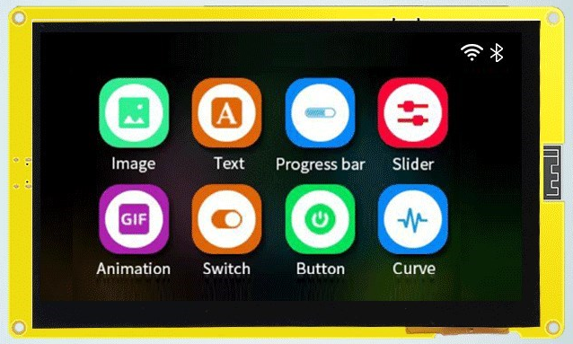

-= SquareLineStudio-for-7inch_Esp32_8048S070C_v1.0 =-

# Board definition for HMI 7"LCD Esp32-8048S070C

[Aliexpress link.](https://pl.aliexpress.com/item/1005004952726089.html)

Generated files for [VS Code](https://code.visualstudio.com/) + [PlatformIO](https://platformio.org/)

[Board definiton for 4" LCD version.](https://github.com/dkm1978/SquareLineStudio-for-7inch_Esp32_8048S070C_v1.0) 
[Board definiton for Simple GUI tester.](https://github.com/dkm1978/SquareLineStudio-for-7inch_Esp32_8048S070C_v1.0) 

# Have FUN xD
